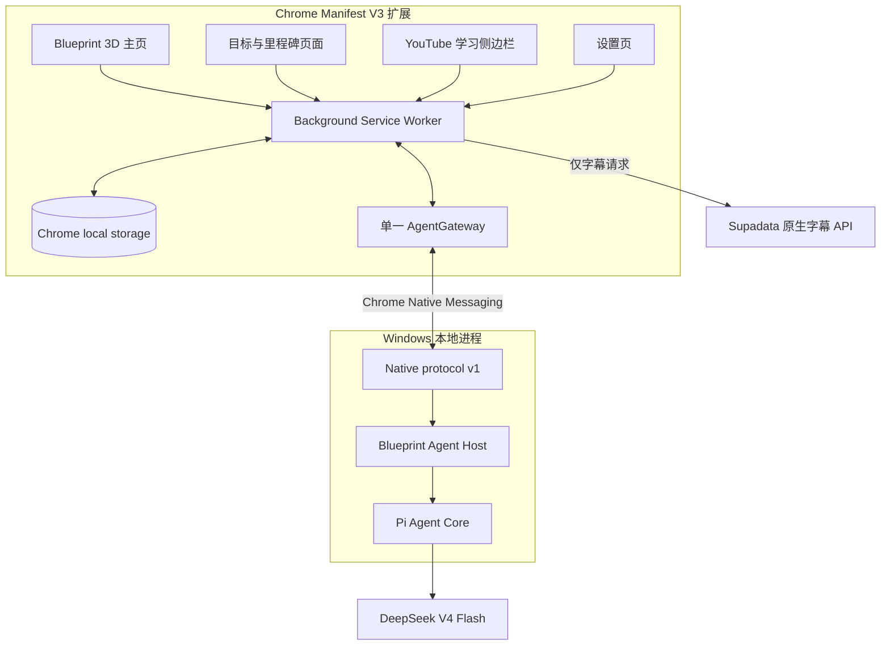
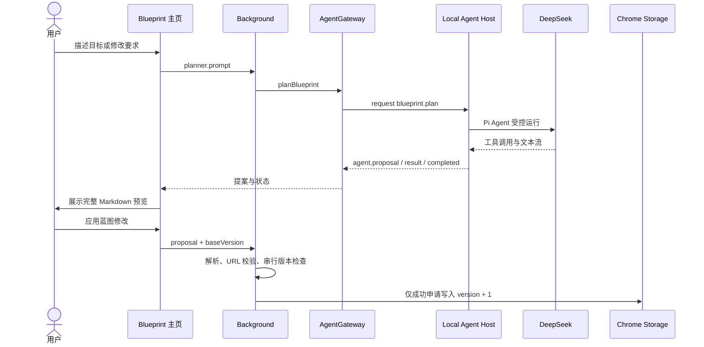
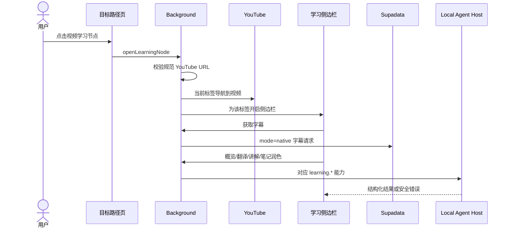

# Blueprint 系统架构

## 1. 架构目标

Blueprint 的架构需要同时满足四个要求：

1. 保留浏览器扩展轻量、伴随网页工作的产品形态。
2. 将 Pi Agent SDK 和 LLM 网络调用封装为本地服务，而不是暴露给扩展页面。
3. 让目标规划和 YouTube 学习能力共享同一个 Agent 边界。
4. 对密钥、提案写入、并发、超时和不可信模型输出建立失败关闭的约束。

## 2. 最终产品拓扑



项目没有开发者运营的云后端。Supadata 由扩展直接访问；所有 LLM 能力由本地 Host 访问 DeepSeek。

## 3. 组件职责

| 组件 | 主要文件 | 职责 |
| --- | --- | --- |
| 3D 蓝图主页 | [`blueprint-src.js`](../blueprint-src.js)、[`blueprint.html`](../blueprint.html)、[`blueprint.css`](../blueprint.css) | 渲染人物、顶层目标、规划师对话和提案确认 |
| 蓝图领域模型 | [`blueprint-domain.js`](../blueprint-domain.js) | 解析 Markdown、生成稳定 ID、校验层级和 YouTube 链接、规范化持久化状态 |
| 目标路径 | [`goal.js`](../goal.js)、[`goal.html`](../goal.html)、[`goal.css`](../goal.css) | 展示里程碑与学习节点，并将已绑定节点交给后台打开 |
| YouTube 学习界面 | [`content.js`](../content.js)、[`sidepanel.js`](../sidepanel.js)、[`sidepanel.html`](../sidepanel.html) | 注入学习入口，展示字幕、概览、翻译、讲解和笔记 |
| 扩展协调层 | [`background.js`](../background.js) | 管理存储、Supadata、蓝图提交、YouTube 跳转和全部 Agent 能力路由 |
| Native 客户端 | [`agent-gateway.js`](../agent-gateway.js) | 建立单一持钥会话、映射能力、校验事件序列、取消和超时 |
| 设置 | [`options.js`](../options.js)、[`settings.js`](../settings.js) | 配置用户 Key、主题、语言和本地数据；Agent 状态统一向后台查询 |
| 本地 Agent Host | [`apps/native-agent-host/src`](../apps/native-agent-host/src) | 校验请求、管理会话、运行 Pi Agent、调用 DeepSeek、投射安全错误 |
| 共享协议 | [`packages/native-protocol/src/index.js`](../packages/native-protocol/src/index.js) | 定义协议版本、能力集合、消息信封和 Native Messaging 帧 |

## 4. 蓝图数据模型

蓝图以 Markdown 为事实来源，解析结构作为渲染缓存随状态一同保存：

```ts
type BlueprintState = {
  version: number;
  markdown: string;
  parsed: {
    goals: Array<{
      id: string;
      title: string;
      milestones: Array<{
        id: string;
        title: string;
        nodes: Array<{
          id: string;
          title: string;
          completed: boolean;
          youtubeUrl: string;
        }>;
      }>;
    }>;
  };
  theme: "sci-fi" | "cyberpunk" | "wuxia" | "urban";
  updatedAt: number;
};
```

存储键：

- `blueprint_state_v1`：蓝图状态。
- `blueprint_planner_messages_v1`：最近的规划师对话，最多保留 100 条有效消息。
- `ytd_settings`：Supadata、DeepSeek 和模型设置。
- `digest_*`、翻译缓存和 `ytd_notes`：既有 YouTube 学习数据。

### 4.1 Markdown 语法

```markdown
# 我的蓝图

## 顶层目标
### 里程碑
- 学习节点
- [x] 已完成节点
- 视频节点 | https://www.youtube.com/watch?v=VIDEO_ID
```

当前约束包括：

- 最多 12 个顶层目标。
- 蓝图 Markdown 最长 512,000 字符。
- 每个目标最多 64 个里程碑。
- 每个里程碑最多 256 个学习节点。
- 顶层目标和里程碑 ID 在各自作用域内唯一。
- 视频绑定只接受规范的 `https://www.youtube.com/watch?v=...` 链接。

## 5. Agent 能力模型

协议只允许五种能力：

| 能力 | 调用方 | Host 行为 | Agent 工具 |
| --- | --- | --- | --- |
| `blueprint.plan` | 3D 主页规划师 | 基于当前蓝图生成完整修订提案 | `read_blueprint`、`propose_blueprint_revision` |
| `learning.analyze_video` | 学习侧边栏 | 生成章节、关键内容和时间戳结构 | 无 |
| `learning.explain_selection` | 学习侧边栏 | 结合上下文讲解用户选中文本 | 无 |
| `learning.translate_transcript_batch` | 学习侧边栏 | 对稳定 ID 的字幕分段做结构化翻译 | 无 |
| `learning.polish_note` | 笔记流程 | 润色目标字幕片段；失败时保留原始笔记 | 无 |

规划 Agent 必须先调用 `read_blueprint`，再调用 `propose_blueprint_revision`。如果只输出自由文本、工具顺序错误或预算耗尽前没有形成提案，Host 返回错误，不把自由文本兜底成蓝图。

## 6. 关键数据流

### 6.1 规划与提案应用



后台使用 Promise 队列串行化完整的 `get → version check → set` 临界区。同一基础版本的并发提案只能有一个成功，其他请求返回 `BLUEPRINT_VERSION_CONFLICT`。

### 6.2 YouTube 学习



## 7. Native Messaging 协议

### 7.1 帧格式

```text
4 字节 little-endian 无符号长度
+ UTF-8 JSON 消息体
```

共享协议默认最大消息为 1 MiB；Host 解码入口允许最多 2 MiB 输入，但输出仍经过共享编码上限。消息必须包含匹配的 `protocolVersion`、`requestId`、`sessionId`、类型、输入对象，以及能力请求对应的 allowlist capability。

### 7.2 生命周期

控制消息：

- `session.open`
- `session.close`
- `agent.abort`

Agent 事件按请求从 `seq=0` 严格递增，典型顺序为：

```text
agent.started
→ agent.text_delta / agent.proposal（可选，多次）
→ agent.result
→ agent.completed
```

异常终态为 `agent.error` 或 `agent.aborted`。协议版本、会话、能力或序号不匹配时，Gateway 失败关闭。

## 8. 密钥与信任边界

- Supadata Key 和 DeepSeek Key 保存在 Chrome 的受信任扩展存储上下文中。
- Content Script 不能读取扩展存储中的 Key。
- DeepSeek Key 只在建立 Native Messaging 会话时交给 Host，能力输入不重复携带 Key。
- 设置变化会关闭旧会话；下次请求使用新配置重新建立会话。
- 设置页不创建第二个 AgentGateway，状态检查统一通过 Background。
- Host 只在进程会话内存中保存 DeepSeek Key，不写磁盘，不在安全错误中回显 Key。
- Native Host manifest 固定允许发布版扩展 ID `kipaapemlimhdkpcenelpjeccmnkninf`。

## 9. 资源与失败边界

- Agent 最多运行 4 个轮次、2 次工具调用。
- 模型输出上限固定为 16,384 tokens。
- Host 无进展 50 秒后中止，单次请求硬上限 120 秒。
- Gateway 等待上限为 130 秒，并在超时后发送 abort。
- 用户可以主动停止规划生成。
- 不支持的能力、目标链接、字幕批次或模型输出结构会被拒绝或规范化。
- 笔记润色失败时仍保存准确原文，并标记润色未完成。

## 10. 构建与交付

```text
npm run build:extension  → 将 Three.js 打入 blueprint.js
npm run build:host       → 构建 Host bundle
npm run package          → 生成白名单控制的扩展 ZIP
npm run package:host     → 生成 Windows x64 SEA EXE 和安装包
npm run package:all      → 构建并打包两个组件
```

Host 打包固定使用 Node 22.23.2，校验上游 ZIP SHA-256，并生成：

- `blueprint-agent-host.exe`
- `install.ps1` / `uninstall.ps1`
- Native Host 示例 manifest
- `BUILD-PROVENANCE.json`
- `SHA256SUMS`

当前本地开发 EXE 未做 Authenticode 签名。校验和可以发现单个文件损坏或替换，但不能在整个包被攻击者替换时证明发布者身份。

## 11. 架构决策摘要

| 决策 | 原因 | 代价 |
| --- | --- | --- |
| Chrome 扩展 + 本地 Host | 保留网页伴随体验，同时隔离 SDK 和 LLM 传输 | Windows 需要额外安装步骤 |
| Markdown 为事实来源 | 可读、可审阅、适合 Agent、易迁移 | 复杂图结构表达能力有限 |
| 单一 Background Gateway | 统一密钥生命周期和协议状态 | Background 成为能力协调中心 |
| Agent 只提案 | 保留用户控制，避免模型直接改数据 | 多一步确认交互 |
| Supadata 由扩展直连 | 保留现有字幕路径，不扩大 Agent Host 职责 | 存在两个明确的外部数据处理方 |
| 主题与结构解耦 | 可持续增加表现主题而不迁移数据 | 主题不能自行创造新业务语义 |
