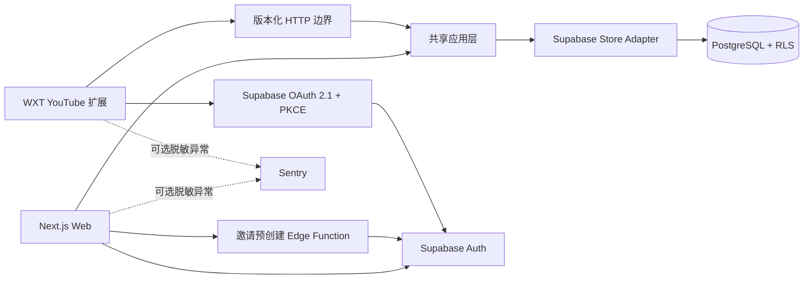

# Blueprint 当前系统架构（M1 与后续已实现切片）

## 1. 架构目标

M1 只证明一条完整云端路径：受邀用户登录 Web，建立并确认通用蓝图，在 YouTube 扩展中授权读取同一份数据，并明确回写一条学习会话。Agent、3D、字幕与推荐不进入本阶段运行链路。

旧 `2.0.0` 扩展和 Windows Native Agent Host 已由标签 `v2.0.0` 固化，当前源码不再包含其运行时或兼容层。

## 2. 产品拓扑



Web 与扩展共享领域语义，但不共享会话。Web 使用 Cookie 会话；扩展是可单独撤销的 Public OAuth Client，并在 Background 中保管 token。

## 3. 模块边界

| 模块 | 位置 | 公开职责 |
| --- | --- | --- |
| 领域模型 | `packages/domain` | 校验 Blueprint Snapshot、YouTube 绑定和依赖图；生成差异与 Markdown 导出 |
| 应用层 | `packages/domain/src/application.ts` | 授权、幂等、提案确认、版本冲突和学习会话用例 |
| Web | `apps/web` | 登录、结构化编辑、提案预览/确认、连接管理、同进程应用调用与扩展 HTTP 边界 |
| 扩展 | `apps/extension` | OAuth、账号隔离缓存、视频匹配、显式学习会话和离线恢复 |
| 共享 UI | `packages/ui` | 基础控件与语义 Token 不持有业务状态；独立导出的成果界面维护展示／草稿恢复，通过注入的保存与重读接口连接双端，不持有账号凭据或数据库实现 |
| 数据适配 | `apps/web/src/lib/supabase` | 将规范化关系表组合为 Snapshot，并实现应用层 Store Port |
| 数据库 | `supabase` | 结构化事实来源、原子提案应用、修订、RLS 和邀请白名单 |

应用层接口是主要深模块：页面和 HTTP Route 都调用同一组用例；Supabase 查询与表结构不会泄漏到扩展或编辑组件。

## 4. 领域模型

```text
Blueprint（每个用户一份）
└─ Goal
   └─ Stage
      └─ Path Node: learn | practice | checkpoint | reflection
         ├─ dependencyIds（只能指向同一 Goal，且无环）
         └─ Resource Binding（M1 仅 youtube_video，可选）
```

稳定实体存储在 PostgreSQL。`BlueprintSnapshot` 是跨应用边界的完整、版本化读模型，也是提案审阅与 Markdown 导出的来源，不是数据库中的唯一事实来源。

正式修改遵循：

```text
读取 version N
→ 本地编辑 Snapshot
→ 创建 Proposal(baseVersion=N)
→ 用户查看 Diff
→ 应用 RPC 锁定当前 Blueprint
→ 只有仍为 N 时写入全部关系实体
→ version N+1 + Revision
```

正式表不给认证客户端直接写权限。原子函数校验 owner、拒绝扩展 client、保持稳定 ID，并在同一事务中处理移动、归档、依赖和资源。

## 5. 身份与权限

### Web

公开的邮件登录请求接口先调用 `prepare-invited-login` Edge Function。该函数的管理员密钥由 Supabase 平台托管，仅在私有白名单命中时预创建 Auth 用户，并始终返回相同成功形态，避免暴露邮箱是否受邀。数据库触发器在创建用户时自动消耗邀请。随后 Web 使用 Supabase 默认 Magic Link，并在回调中以 PKCE code 建立 Cookie 会话。Next.js 请求代理负责校验访问令牌，并把 Supabase 轮换后的会话 Cookie 写回浏览器；Vercel 不持有 Supabase 管理员密钥。

已登录请求的身份解析使用显式结果，不把 Auth 提供方 429／5xx 当成退出登录：HTTP 读取／写入入口返回 503 `unavailable`，提案 Action 返回可重试结果；主页、登录、连接设置与扩展授权页显示保留当前内部路径的重试入口，不要求再次申请邮件。真正缺失或失效的会话仍走未登录处理。

一次性登录回调使用 Auth 交换响应中的用户和 SDK 已保存的 Cookie 会话；不再追加一个可能失败的用户查询来否定成功交换。受保护目标页面仍独立验证身份，并在故障时提供不含 code 的恢复入口。显式 `sb_flow_id` 交给 SDK 选择对应 PKCE 校验信息；交换不确定时提示稍后申请新链接，不自动重发或重放旧 code。回调禁用缓存及 Referer，内部跳转过滤反斜杠和控制字符，防止浏览器归一化为外站。依据 [Supabase PKCE 交换说明](https://supabase.com/docs/reference/javascript/auth-exchangecodeforsession)及仓库锁定 SDK 验证。

主动退出保留原有 `global` 范围，并明确标为“退出所有设备”。SDK 返回错误或调用异常时进入独立恢复页；客户端响应丢失时只提供只读状态检查，不直接重放退出。恢复页独立验证身份：仍已登录才提供显式重试，没有有效登录则提供重新登录后返回恢复页的路径，提供方不可用则只允许重新检查。浏览器 Cookie 被 SDK 清除不等于云端撤销成功；退出会话也不等于撤销扩展的长期 OAuth 授权，已经签发的 JWT 仍存在过期窗口，见 [Supabase signOut](https://supabase.com/docs/reference/javascript/auth-signout)。本地已覆盖服务端失败、响应丢失、重复提交与页面恢复；认证增量已于 2026-09-10 部署并完成候选／正式域名冒烟，其余真实托管验收仍待完成。

### 扩展

扩展使用 Authorization Code + PKCE：

1. Background 生成 verifier、challenge 和 state。
2. `chrome.identity.launchWebAuthFlow` 打开 Supabase 授权页。
3. 已登录用户在 Web 授权页确认。
4. Background 校验 state，以 code 换取扩展自己的 token。
5. token 过期前使用 refresh token 更新；Web 可列出并撤销授权。

固定 manifest key 保持扩展 ID 和 OAuth callback 不变。扩展 RLS 能读取自身蓝图、创建自身学习会话和事件，但不能读取 Proposal/Revision，也不能修改正式蓝图。

## 6. 数据读取与写回

P4 节点规划增量在本地采用 Snapshot 2：预计分钟与完成依据显式进入节点、提案差异和正式修订。当前写入不接受旧格式／未知键；历史 Snapshot 1 仍独立解码且不改写。新 `read_blueprint_snapshot_v2` 供当前 Store 使用，保留既有单语句快照与权限；旧读取函数仅保留旧格式只读投影。新增迁移尚未托管，发布需处理旧格式写入拒绝窗口与旧安装扩展的格式支持，不能直接覆盖发布后声称兼容。界面、迁移与验证见[节点规划增量](node-planning.md)。

节点资源以已确认提案数组为顺序来源，手工／规划／采用共用写入核心，不接受客户端资源位置字段。后续[顺序修复](resource-order.md)只作用于新的明确确认，不回填旧存储或改写历史修订；调整顺序和移除保留学习归属，原确认重放不覆盖新状态。

P4 已增加独立于正式路径的 Goal Brief：规划前定义支持不完整草稿、明确确认、修改后重新确认、独立修订及精确请求回执。仅 Web 当前账号可访问，确认定义不修改 BlueprintSnapshot；未来 Agent 仍需单独校验确认修订并生成提案。领域模型／数据库／Action 已接入双主题列表、卡片与安全恢复，并随 `c53111f` 托管发布；真实托管登录旅程尚未验收，Agent 尚未接入，详见[目标定义工作台](goal-briefs.md)。

P6 的[内部路径规划器](agent-path-planning.md)默认未启用真实供应商：固定版本 Skill 加 AI SDK 结构化输出，接收已确认定义和蓝图快照，只返回隔离草案，不持有数据库写入或检索工具。[云端运行编排](agent-planning-runs.md)已在本地连接真实 Auth／PostgREST：用户身份读取真实来源并预留一次额度，受限 Edge 领取唯一执行权，Node 在事务之外调用规划器，再通过 Edge 保存完整结果及 Skill 并复核来源修订。取消、超时、并发及响应丢失均不能自动重跑模型；新账号默认零次，次数保护不等于人民币账务。用户只能恢复自己的运行，扩展不能调用规划，模型仍不能修改正式蓝图。

[规划记录与草案阅读](agent-planning-review.md)已本地接入用户页面：从目标定义列出历史 ID／日期，独立地址通过运行 RPC 获取当前状态；账号绑定的 Server Actions 刷新和取消。该访问模块没有模型或服务端特权密钥，页面不引入生成器／Skill 文件加载。

[规划草案确认](agent-planning-approval.md)已本地接入同一页面。准备从持久运行创建唯一提案，私人关联表绑定来源；关联提案不能通过客户端改表替换。用户单独确认后才写正式蓝图，公开确认入口统一经过 Blueprint-first 私有守卫，原子检查 Goal Brief 与蓝图来源，再调用保留的 v2 写入实现。精确成功重试返回该提案的历史修订版本；拒绝与刷新不会生成或修改正式路径。页面遇到身份失败隐藏私人内容，响应不确定时先读回状态。当前仍不提供真实模型生成，未托管发布，不代表完整 M1 Agent 链路已交付。

当前蓝图读取使用单次 `STABLE SECURITY INVOKER` RPC，将版本与完整层级固定在同一个数据库语句快照内，避免并发确认时拼接旧版本和新节点。它保留 owner RLS、精确扩展授权和现有写入版本保护；不修改实体或修订。本地真实并发已验证，托管迁移与依赖版本已按顺序发布；权限与发布证据及未验收边界见[蓝图一致性读取](blueprint-read-consistency.md)。

Web 直接调用应用层。扩展只访问 `/api/v1`：

- 读取完整 Blueprint Snapshot；
- 列出或创建 Learning Session；
- 写入受限的授权和同步结果事件。

用户打开 YouTube watch 页面时，扩展按规范视频 ID 匹配 Resource Binding。只有点击“开始学习”才创建会话，不根据打开页面或观看时长推断学习。

个人应用结果的 HTTP 响应统一设置 `Cache-Control: private, no-store`，包含成功、身份拒绝和临时故障，避免浏览器或共享缓存保留个人数据及旧认证结果。扩展自行管理的账号隔离缓存和 outbox 不依赖 HTTP 缓存。

网络失败或请求超过 15 秒时，学习会话命令以 `ownerId + clientMutationId` 写入扩展 outbox。重新登录或手动重试只处理当前用户命令；服务端唯一约束保证重复投递不会生成两条会话。成果记录采用独立的持久化原提交恢复策略，不进入此队列。

## 7. 隐私与观测

本地已实现独立的 Node Status Confirmation：用户自评状态及可选成果关联保存为不可覆盖的确认历史；数据库捕获当时的路径、预计投入和完成依据，同时校验蓝图版本和节点状态修订，精确请求回执支持重试。状态不进入规划 Snapshot，也不改写成果或自动判定掌握。同一语句读取当前蓝图与状态，Web 使用账号绑定 Action，扩展接口沿用精确 OAuth 身份规则。恢复、历史、权限和实际验证见[节点状态确认](node-status.md)；该增量尚未托管。

P4 私人成果迁移及 Web `/progress`／API 已托管发布；数据库角色与匿名 HTTP 检查通过，真实登录后的双端旅程仍待验收。扩展共享界面通过独立 MV3／外部 HTTP 夹具验证，尚未重载用户安装版：成果独立于 BlueprintSnapshot，由数据库捕获提交时的路径上下文，使用独立提交 ID 去重，不改变完成状态。Web 通过账号绑定 Action、扩展通过账号绑定消息与 Bearer API 写入及重读；共享 UI 模块维护草稿恢复、近期历史和安全外链。双端本机草稿按账号／蓝图隔离，并用 Web Locks 防止同源多页覆盖；回执不明重试原提交，版本变化需明确重绑定。未提交缓存只作短期恢复，不跨端同步。精确 OAuth 白名单与 owner RLS 双重约束，客户端不能直接写表；不接入旧 outbox。边界、迁移和验证见[私人成果记录](progress-evidence.md)。

Product Event 只允许固定事件名、surface、实体 ID、短 result code、duration bucket 和时间，不包含目标正文、提案 Snapshot、字幕或笔记。

Sentry 未配置 DSN 时关闭；配置后也会在发送前移除请求 headers/body/query、邮箱、IP、extra、contexts 和 breadcrumb data。客户端构建检查会拒绝 Service Role Key、DeepSeek endpoint、Supadata endpoint 和 key 形态文本。

## 8. 质量门槛

- Vitest：领域不变量、提案/幂等用例、扩展视频匹配与账号隔离恢复。
- 嵌入式 PostgreSQL：实际执行迁移，验证直接写拒绝、原子应用、幂等、会话归属和 RLS 隔离。
- pgTAP + 本地 Supabase：验证 Supabase 角色、策略和函数部署。
- Playwright：桌面与移动登录流程、状态恢复和横向溢出。
- 生产构建：Next.js 与 WXT 均以真实构建产物为准，再检查扩展权限和密钥边界。

本机没有 Docker 时，嵌入式测试可以提供快速数据库证据，但不能替代 `supabase test db` 和真实托管环境授权验收。

P6 [用户主动发起规划](agent-planning-entry.md)已补齐本地生成入口。Cookie Web 的同源 POST 单独运行，避免等待模型时阻塞取消操作；严格绑定账号、运行与来源修订，数据库保护次数及唯一执行权。Node 用用户 JWT 与独立服务凭据调用固定 Edge 领取／保存操作，Edge 自行验证身份并确定 owner；管理员密钥只在 Edge，不能放进 Vercel。官方 DeepSeek SDK 固定使用 `deepseek-v4-flash`；版本化 Skill 已加入服务端追踪，生成结果仍须用户确认才入图。默认关闭开关，不读取浏览器提供的模型、地址或密钥。未来启用需独立凭据及实际额度安排；当前托管没有配置或发布该增量，不能据离线供应商夹具宣称真实模型或费用验收。

P7 [视频候选检索](resource-discovery.md)已有独立内部服务端模块：固定 YouTube／Supadata 来源，筛选元信息并检查最多三条原生字幕。[资源匹配 Skill](agent-resource-matching.md)检查来源修订、有限 ID 和字幕引文，只产生待审阅建议。[持久运行层](agent-resource-runs.md)从已认证账号读取当前节点，将检索、字幕任务读取、匹配分别预留次数并授予一次执行权；后续输入只取自服务器保存的上一步结果。读取不执行，过期／来源修改不复活旧建议，未获得执行权的取消才退款。[独立执行入口](agent-resource-entry.md)连接生产 Node 与真实身份核验的 Edge worker，默认关闭且 Web 不持有管理员密钥。[双主题资源工作台](resource-workbench.md)通过精简视图展示当前节点、历史和引文，不下发完整蓝图／字幕／任务 ID／Skill。[明确采用／替换](resource-adoption.md)增加独立单视频核验与不可变提案，最终确认在同一事务核对来源及十分钟有效期；新绑定不改写旧学习会话归属。本地真实 Auth／数据库和第三方 HTTP 夹具已接通，只有用户确认才写正式绑定；字幕保留策略、真实服务消费与托管发布仍待完成。

## 9. ADR

- [ADR-0001：云端事实来源与提案边界](adr/0001-cloud-source-of-truth.md)
- [ADR-0002：扩展 OAuth 边界](adr/0002-extension-oauth.md)
- [ADR-0003：从设计之初支持多主题产品](adr/0003-multi-theme-product-design.md)

本文记录当前源码切片。共享双主题基础、账号偏好与成果界面已接入；本地 P5 增量通过只读领域投影，从同一语句读取的正式蓝图和节点自评生成首页焦点／下一步及完整路径，编辑器迁到独立入口，见[首页与正式路径](home-paths.md)。公开 `/preview` 静态页面使用无个人数据／Action 接口的独立模块；Proxy 仅精确豁免该路径的会话刷新，根入口仍验证身份后分流，私人路由权限不变，见[公开示例](public-preview.md)。正式 3D 主题装配与完整身份／外观分离仍待完成，见[目标 UI/UX 规划](target-ui-ux-plan.md#9-视觉与多主题架构)；不能把基础组件与页面验证等同于完整主题产品验收。
