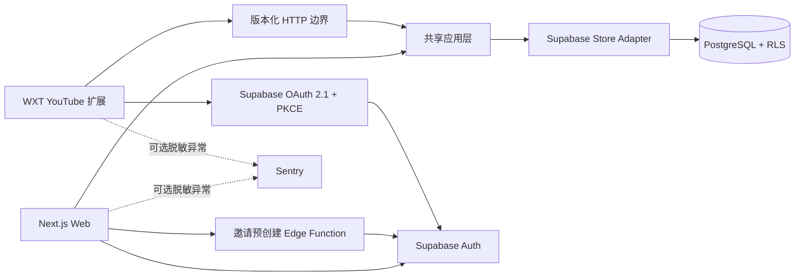

# Blueprint 当前系统架构（M1）

## 1. 架构目标

M1 只证明一条完整云端路径：受邀用户登录 Web，建立并确认通用蓝图，在 YouTube 扩展中授权读取同一份数据，并明确回写一条学习会话。Agent、3D、字幕与推荐不进入本阶段运行链路。

旧 `2.0.0` 扩展和 Windows Native Agent Host 已由标签 `v2.0.0` 固化，当前源码不再包含其运行时或兼容层。

## 2. 产品拓扑



Web 与扩展共享领域语义，但不共享会话。Web 使用 Cookie 会话；扩展是可单独撤销的 Public OAuth Client，并在 Background 中保管 token。

## 3. 模块边界

| 模块 | 位置 | 公开职责 |
| --- | --- | --- |
| 领域模型 | `packages/domain` | 校验 Blueprint Snapshot、YouTube 绑定和依赖图；生成差异与 Markdown 导出 |
| 应用层 | `packages/domain/src/application.ts` | 授权、幂等、提案确认、版本冲突和学习会话用例 |
| Web | `apps/web` | 登录、结构化编辑、提案预览/确认、连接管理、同进程应用调用与扩展 HTTP 边界 |
| 扩展 | `apps/extension` | OAuth、账号隔离缓存、视频匹配、显式学习会话和离线恢复 |
| UI 基础 | `packages/ui` | 语义 Token、按钮、面板和状态组件，不承载业务状态 |
| 数据适配 | `apps/web/src/lib/supabase` | 将规范化关系表组合为 Snapshot，并实现应用层 Store Port |
| 数据库 | `supabase` | 结构化事实来源、原子提案应用、修订、RLS 和邀请白名单 |

应用层接口是主要深模块：页面和 HTTP Route 都调用同一组用例；Supabase 查询与表结构不会泄漏到扩展或编辑组件。

## 4. 领域模型

```text
Blueprint（每个用户一份）
└─ Goal
   └─ Stage
      └─ Path Node: learn | practice | checkpoint | reflection
         ├─ dependencyIds（只能指向同一 Goal，且无环）
         └─ Resource Binding（M1 仅 youtube_video，可选）
```

稳定实体存储在 PostgreSQL。`BlueprintSnapshot` 是跨应用边界的完整、版本化读模型，也是提案审阅与 Markdown 导出的来源，不是数据库中的唯一事实来源。

正式修改遵循：

```text
读取 version N
→ 本地编辑 Snapshot
→ 创建 Proposal(baseVersion=N)
→ 用户查看 Diff
→ 应用 RPC 锁定当前 Blueprint
→ 只有仍为 N 时写入全部关系实体
→ version N+1 + Revision
```

正式表不给认证客户端直接写权限。原子函数校验 owner、拒绝扩展 client、保持稳定 ID，并在同一事务中处理移动、归档、依赖和资源。

## 5. 身份与权限

### Web

公开的邮件登录请求接口先调用 `prepare-invited-login` Edge Function。该函数的管理员密钥由 Supabase 平台托管，仅在私有白名单命中时预创建 Auth 用户，并始终返回相同成功形态，避免暴露邮箱是否受邀。数据库触发器在创建用户时自动消耗邀请。随后 Web 使用 Supabase 默认 Magic Link，并在回调中以 PKCE code 建立 Cookie 会话。Next.js 请求代理负责校验访问令牌，并把 Supabase 轮换后的会话 Cookie 写回浏览器；Vercel 不持有 Supabase 管理员密钥。

已登录请求的身份解析使用显式结果，不把 Auth 提供方 429／5xx 当成退出登录：HTTP 读取／写入入口返回 503 `unavailable`，提案 Action 返回可重试结果；主页、登录、连接设置与扩展授权页显示保留当前内部路径的重试入口，不要求再次申请邮件。真正缺失或失效的会话仍走未登录处理。

一次性登录回调使用 Auth 交换响应中的用户和 SDK 已保存的 Cookie 会话；不再追加一个可能失败的用户查询来否定成功交换。受保护目标页面仍独立验证身份，并在故障时提供不含 code 的恢复入口。显式 `sb_flow_id` 交给 SDK 选择对应 PKCE 校验信息；交换不确定时提示稍后申请新链接，不自动重发或重放旧 code。回调禁用缓存及 Referer，内部跳转过滤反斜杠和控制字符，防止浏览器归一化为外站。依据 [Supabase PKCE 交换说明](https://supabase.com/docs/reference/javascript/auth-exchangecodeforsession)及仓库锁定 SDK 验证。

主动退出保留原有 `global` 范围，并明确标为“退出所有设备”。SDK 返回错误或调用异常时进入独立恢复页；客户端响应丢失时只提供只读状态检查，不直接重放退出。恢复页独立验证身份：仍已登录才提供显式重试，没有有效登录则提供重新登录后返回恢复页的路径，提供方不可用则只允许重新检查。浏览器 Cookie 被 SDK 清除不等于云端撤销成功；退出会话也不等于撤销扩展的长期 OAuth 授权，已经签发的 JWT 仍存在过期窗口，见 [Supabase signOut](https://supabase.com/docs/reference/javascript/auth-signout)。本地已覆盖服务端失败、响应丢失、重复提交与页面恢复；认证增量已于 2026-09-10 部署并完成候选／正式域名冒烟，其余真实托管验收仍待完成。

### 扩展

扩展使用 Authorization Code + PKCE：

1. Background 生成 verifier、challenge 和 state。
2. `chrome.identity.launchWebAuthFlow` 打开 Supabase 授权页。
3. 已登录用户在 Web 授权页确认。
4. Background 校验 state，以 code 换取扩展自己的 token。
5. token 过期前使用 refresh token 更新；Web 可列出并撤销授权。

固定 manifest key 保持扩展 ID 和 OAuth callback 不变。扩展 RLS 能读取自身蓝图、创建自身学习会话和事件，但不能读取 Proposal/Revision，也不能修改正式蓝图。

## 6. 数据读取与写回

Web 直接调用应用层。扩展只访问 `/api/v1`：

- 读取完整 Blueprint Snapshot；
- 列出或创建 Learning Session；
- 写入受限的授权和同步结果事件。

用户打开 YouTube watch 页面时，扩展按规范视频 ID 匹配 Resource Binding。只有点击“开始学习”才创建会话，不根据打开页面或观看时长推断学习。

个人应用结果的 HTTP 响应统一设置 `Cache-Control: private, no-store`，包含成功、身份拒绝和临时故障，避免浏览器或共享缓存保留个人数据及旧认证结果。扩展自行管理的账号隔离缓存和 outbox 不依赖 HTTP 缓存。

网络失败或请求超过 15 秒时，命令以 `ownerId + clientMutationId` 写入扩展 outbox。重新登录或手动重试只处理当前用户命令；服务端唯一约束保证重复投递不会生成两条会话。

## 7. 隐私与观测

P4 私人成果数据与 Web `/progress` 成长档案已通过本地验证，未托管发布，扩展成果 UI 待实现：成果独立于 BlueprintSnapshot，由数据库捕获提交时的路径上下文，使用独立提交 ID 去重；不改变完成状态。Web 通过账号绑定 Action 写入与重读工作区，配置的扩展通过 Bearer API 写入，双方可读取私人近期记录。Web 草稿按账号／蓝图缓存并用 Web Locks 防止多标签覆盖；回执不明重试原提交，版本变化需明确重绑定。缓存仅作短期恢复。精确 OAuth 白名单与 owner RLS 双重约束，客户端不能直接写表；尚不接入旧 outbox。边界、迁移和验证见[私人成果记录](progress-evidence.md)。

Product Event 只允许固定事件名、surface、实体 ID、短 result code、duration bucket 和时间，不包含目标正文、提案 Snapshot、字幕或笔记。

Sentry 未配置 DSN 时关闭；配置后也会在发送前移除请求 headers/body/query、邮箱、IP、extra、contexts 和 breadcrumb data。客户端构建检查会拒绝 Service Role Key、DeepSeek endpoint、Supadata endpoint 和 key 形态文本。

## 8. 质量门槛

- Vitest：领域不变量、提案/幂等用例、扩展视频匹配与账号隔离恢复。
- 嵌入式 PostgreSQL：实际执行迁移，验证直接写拒绝、原子应用、幂等、会话归属和 RLS 隔离。
- pgTAP + 本地 Supabase：验证 Supabase 角色、策略和函数部署。
- Playwright：桌面与移动登录流程、状态恢复和横向溢出。
- 生产构建：Next.js 与 WXT 均以真实构建产物为准，再检查扩展权限和密钥边界。

本机没有 Docker 时，嵌入式测试可以提供快速数据库证据，但不能替代 `supabase test db` 和真实托管环境授权验收。

## 9. ADR

- [ADR-0001：云端事实来源与提案边界](adr/0001-cloud-source-of-truth.md)
- [ADR-0002：扩展 OAuth 边界](adr/0002-extension-oauth.md)
- [ADR-0003：从设计之初支持多主题产品](adr/0003-multi-theme-product-design.md)

本文记录当前 M1。尚未实现的主题装配、首页展示模型、身份与外观分离及场景边界见[目标 UI/UX 规划](target-ui-ux-plan.md#9-视觉与多主题架构)，不应据此把当前 UI 基础包视为已经具备主题体系。
