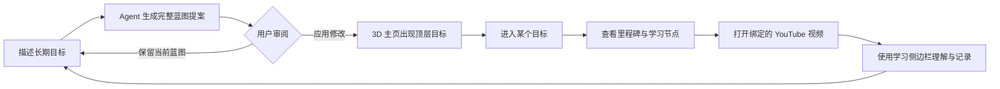

# Blueprint 产品理念

## 1. 产品命题

个人目标通常不是缺少信息，而是缺少结构。用户可能知道自己想“学会机器学习”“转型为独立开发者”或“完成一部长篇小说”，却很难同时回答：

- 这个目标由哪些顶层能力组成？
- 每项能力应按什么顺序获得？
- 当前阶段最值得投入的学习节点是什么？
- 规划和日常学习如何连接，而不是分散在聊天、笔记、视频收藏和待办列表中？

Blueprint 的核心命题是：**先让目标拥有一张可理解的全局地图，再让每一次学习成为地图上的一次推进。**

它不是把大目标简单拆成更多待办，也不是让 Agent 直接替用户决定人生路径。Blueprint 提供的是一个由 Agent 协助生成、由用户审阅和拥有、可以持续修订的目标模型。

## 2. 核心价值

### 2.1 从意图到结构

用户用自然语言描述目标，规划师将其转换为稳定的 Markdown 层级：

```text
目标意图
  → 顶层目标
    → 里程碑
      → 学习节点
```

这个层级既适合 Agent 生成，也适合人阅读、版本化、迁移和审查。3D 只是蓝图的表达层，Markdown 才是可持续演进的语义层。

### 2.2 从全局感到下一步

主页用“人物位于中心、目标围绕人物”的空间隐喻表达：目标不是外部项目列表，而是用户希望成为谁的一部分。顶层目标提供方向感，进入目标后才逐步展开里程碑和学习节点，避免第一次进入就被细节压垮。

### 2.3 从规划到真实学习

学习节点可以绑定规范的 YouTube 视频链接。用户点击节点后进入 YouTube，并复用现有学习侧边栏完成字幕获取、视频概览、字幕翻译、选文讲解和带时间戳笔记。规划结果因此不是静态图，而是实际学习行为的入口。

### 2.4 Agent 建议，人类决策

规划师只能提出完整蓝图修订，不能直接写入用户数据。每次修改都经过“生成提案—预览—用户确认—版本校验—持久化”的流程。用户始终是目标内容和最终决策的所有者。

## 3. 产品原则

### 原则一：蓝图优先于待办

待办适合执行明确事项，蓝图负责解释事项之间的因果、先后和归属。Blueprint 优先保证用户看懂整体路径，再考虑更细的任务管理能力。

### 原则二：语义稳定，表达可变

科幻、赛博朋克、武侠和现代都市主题可以使用不同颜色、氛围和叙事语言，但不得改变目标、里程碑、学习节点的结构。主题是同一蓝图的不同皮肤，不是四套产品逻辑。

### 原则三：渐进披露

主页只展示人物、顶层目标、规划师和设置。里程碑只在用户进入某个目标后出现；视频学习能力只在用户选择具体学习节点后出现。界面复杂度跟随用户意图逐层展开。

### 原则四：本地优先，边界透明

蓝图、设置、会话和学习数据保存在 Chrome 本地扩展存储中。LLM 能力由用户机器上的 Agent Host 提供，项目不运营账号系统、云数据库或代理后端。涉及 Supadata 和 DeepSeek 的数据流必须对用户清晰可解释。

### 原则五：在内容发生的地方学习

Blueprint 不复制一个新的播放器或课程平台。它把目标路径连接到 YouTube，并让学习侧边栏伴随原视频工作，从而保留内容上下文、时间戳和用户已经熟悉的观看行为。

### 原则六：失败可见、操作可恢复

Agent 缺失、Key 未配置、请求超时、用户取消、蓝图版本冲突或链接无效时，系统应明确说明发生了什么，不静默重试、不伪装成功，也不覆盖较新的蓝图。

### 原则七：有趣服务于持续投入

3D 人物、目标环绕和主题氛围的作用，是提升用户重新打开蓝图的兴趣与身份代入感。视觉效果不能牺牲文字可读性、触控能力、键盘操作或减少动态效果偏好。

## 4. 核心用户旅程



闭环的关键不在于一次生成“完美计划”，而在于用户可以根据学习结果继续与规划师讨论并修订蓝图。

## 5. 当前已实现范围

- 3D 人物中心主页、顶层目标模块和四种主题。
- 基于 Markdown 的目标、里程碑、学习节点结构。
- 基于 Pi Agent 的对话式蓝图规划与完整修订提案。
- 提案预览、用户确认、版本冲突保护和本地持久化。
- 目标路径页面及规范 YouTube watch 链接绑定。
- YouTube 字幕、概览、翻译、选文讲解和笔记能力。
- Chrome 扩展与 Windows 本地 Agent Host 的双组件交付。

## 6. 当前非目标

以下能力不属于当前版本，不应在产品说明中暗示已经提供：

- 自动替用户执行现实世界任务。
- 多用户协作、团队目标、账号同步或云端备份。
- 自动抓取任意网站课程或通用网页 Agent。
- 由开发者托管的 LLM 代理服务或统一额度。
- 自动证明用户已经掌握某项技能。
- 完整游戏化经济、等级、装备或社交排行榜。
- 独立 Windows 图形界面应用。

## 7. 成功信号

当前版本没有遥测，因此成功信号应通过用户研究、可选反馈或本地可见行为验证，而不是假设已经采集数据：

- 用户能否在首次会话中生成并理解第一版蓝图。
- 用户能否解释顶层目标、里程碑和学习节点之间的关系。
- 用户是否愿意在学习后返回并修订蓝图。
- 从目标节点进入 YouTube 学习的路径是否顺畅。
- 用户是否信任“Agent 只提案、自己确认”的控制方式。
- 主题和 3D 表达是否提升重访意愿，同时不妨碍阅读和操作。

## 8. 演进方向

后续迭代可以围绕闭环强度展开，但需要独立产品验证后再进入实现：

1. 学习节点状态与蓝图进度的显式更新。
2. 基于学习结果的复盘和路径调整建议。
3. 更丰富但仍语义等价的主题化目标呈现。
4. 蓝图导入、导出和用户控制的备份能力。
5. 除 YouTube 之外、具有清晰版权和数据边界的学习资源适配器。
