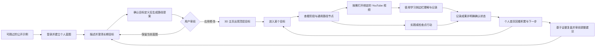

# Blueprint 产品理念

## 1. 产品命题

个人目标通常不是缺少信息，而是缺少结构。用户可能知道自己想“学会机器学习”“转型为独立开发者”或“完成一部长篇小说”，却很难同时回答：

- 这个目标由哪些顶层能力组成？
- 每项能力应按什么顺序获得？
- 当前阶段最值得投入的路径节点是什么？
- 规划和日常学习如何连接，而不是分散在聊天、笔记、视频收藏和待办列表中？

Blueprint 的核心命题是：**先让目标拥有一张可理解的全局地图，再让每一次学习成为地图上的一次推进。**

它不是把大目标简单拆成更多待办，也不是让 Agent 直接替用户决定人生路径。Blueprint 提供的是一个由 Agent 协助生成、由用户审阅和拥有、可以持续修订的目标模型。

## 2. 核心价值

### 2.1 从意图到结构

目标能力中，用户用自然语言描述目标，规划师将其转换为稳定的结构化层级：

```text
目标意图
  → 顶层目标
    → 阶段
      → 路径节点（学习、实践、检查点、复盘）
```

这个层级既适合 Agent 生成，也适合人阅读、版本化、迁移和审查。PostgreSQL 结构化实体是云端事实来源；Markdown 是提案审阅和导出格式。3D 是蓝图的身份表达层，不承担数据语义。

### 2.2 从全局感到下一步

主页用“人物位于中心、目标围绕人物”的空间隐喻表达：目标不是外部项目列表，而是用户希望成为谁的一部分。顶层目标提供方向感，进入目标后才逐步展开阶段和路径节点，避免第一次进入就被细节压垮。日常主页还需要给出当前重点、下一步与可追溯的真实成果，支持持续维护，而不只提供第一次访问时的视觉新鲜感。

### 2.3 从规划到真实学习

学习节点可以绑定规范的 YouTube 视频链接。M1 扩展已经能匹配当前视频并由用户明确开始一条学习会话；字幕获取、视频概览、翻译、选文讲解和笔记将在 M4 重新接入。规划结果因此不是静态图，而是实际学习行为的入口。

### 2.4 Agent 建议，人类决策

规划师只能提出完整蓝图修订，不能直接写入用户数据。每次修改都经过“生成提案—预览—用户确认—版本校验—持久化”的流程。用户始终是目标内容和最终决策的所有者。

## 3. 产品原则

### 原则一：蓝图优先于待办

待办适合执行明确事项，蓝图负责解释事项之间的因果、先后和归属。Blueprint 优先保证用户看懂整体路径，再考虑更细的任务管理能力。

### 原则二：语义稳定，表达可变

多主题从产品设计之初纳入，首发为赛博朋克与东方山水/武侠两套完整的精品风格化主题，覆盖 3D 首页以及目标、规划、学习和成果等界面。角色、场景、面板、排版、动效和有限构图可以变化，但目标、阶段、通用路径节点、证据含义和用户确认保持一致。同一身份与成果延续到不同主题的化身，不要求所有人物与服装共用一个模型。其他主题在该边界下扩展，见 [设计复审](commercial-design-review.md) 与 [ADR-0003](adr/0003-multi-theme-product-design.md)。这些是目标设计，当前 M1 尚无对应实现。

### 原则三：渐进披露

主页聚焦人物、重点目标、下一步与最近成果，保留规划师和必要导航；阶段及完整路径在用户进入目标后展开。视频学习能力只在用户选择带资源的具体节点后出现，界面复杂度跟随用户意图逐层展开。

### 原则四：云端事实来源，边界透明

账号、正式蓝图和学习会话保存在受 RLS 保护的 PostgreSQL 中。Web 和扩展分别维护可撤销会话；扩展本地存储只承担账号隔离缓存和短期恢复。后续引入 DeepSeek、YouTube Data API、Supadata 等处理方时，数据与额度边界必须对用户清晰可解释。

### 原则五：在内容发生的地方学习

Blueprint 不复制一个新的播放器或课程平台。它把目标路径连接到 YouTube，并让学习侧边栏伴随原视频工作，从而保留内容上下文、时间戳和用户已经熟悉的观看行为。

### 原则六：失败可见、操作可恢复

Agent 缺失、Key 未配置、请求超时、用户取消、蓝图版本冲突或链接无效时，系统应明确说明发生了什么，不静默重试、不伪装成功，也不覆盖较新的蓝图。

### 原则七：有趣服务于持续投入

3D 人物、目标环绕和主题氛围的作用，是提升用户重新打开蓝图的兴趣与身份代入感。维护的核心是行动、记录成果和调整下一步，装饰提供补充乐趣；主题切换、打开应用或观看时长不自动变成学习成就。视觉效果不能牺牲文字可读性、触控能力、键盘操作或减少动态效果偏好。按可商用标准设计完整状态、可信反馈和可追溯资产，但不据此声称吸引力或留存已经得到验证。

## 4. 目标用户旅程



公开示例注明演示内容，个人创建时才登录；已有用户直接回到个人首页。闭环的关键不在于一次生成“完美计划”，而在于用户可以根据学习与实践结果继续修订蓝图。最小成果记录和首页反馈前置，完整复盘另行验收，见[执行路线](execution-roadmap.md)。

## 5. 当前 M1 已实现范围

- Next.js Web、WXT 扩展、共享 TypeScript 领域模型和语义 UI Token。
- Blueprint、Goal、Stage、四类通用 Path Node 和独立 YouTube Resource Binding。
- 邀请邮箱邮件链接登录、扩展 OAuth 授权和 Supabase RLS 用户隔离。
- 提案差异预览、用户确认、版本冲突、原子写入和修订记录。
- 扩展读取同一蓝图、匹配当前 YouTube 视频，并显式回写学习会话。
- 账号隔离的缓存与离线队列、脱敏产品事件和可选错误观测。

`2.0.0` 曾实现的本地 3D、Agent Host、字幕与笔记能力保存在历史标签中，不属于当前 `3.0.0` M1 运行链路。

## 6. 当前非目标

以下能力不属于当前版本，不应在产品说明中暗示已经提供：

- 自动替用户执行现实世界任务。
- 多用户协作和团队目标。
- 自动抓取任意网站课程或通用网页 Agent。
- M1 中的 Agent、视频检索、字幕与统一模型额度。
- 自动证明用户已经掌握某项技能。
- 完整游戏化经济、等级、装备或社交排行榜。
- 独立 Windows 图形界面应用。

## 7. 成功信号

M1 只采集不含正文的最小行为事件；产品价值仍应通过用户研究、可选反馈和真实学习证据验证，而不是把行为数量等同于成功：

- 用户能否在首次会话中生成并理解第一版蓝图。
- 用户能否解释目标、阶段和不同类型路径节点之间的关系。
- 用户是否愿意在学习后返回并修订蓝图。
- 从目标节点进入 YouTube 学习的路径是否顺畅。
- 用户是否信任“Agent 只提案、自己确认”的控制方式。
- 主题和 3D 表达是否提升重访意愿，同时不妨碍阅读和操作。

## 8. 演进方向

后续迭代可以围绕闭环强度展开，但需要独立产品验证后再进入实现：

1. 通用路径节点状态、真实成果与蓝图进展的显式更新。
2. 基于学习结果的复盘和路径调整建议。
3. 在两套完整主题基础上增加仍语义等价的主题化目标呈现与外观能力。
4. 蓝图导入、导出和用户控制的备份能力。
5. 除 YouTube 之外、具有清晰版权和数据边界的学习资源适配器。
