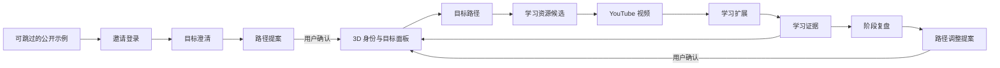

# Blueprint 目标 UI/UX 规划

本文档描述 M2–M5 的目标体验。它不代表当前 `3.0.0` M1 源码已经具备正式 3D、Agent 或学习工作台；当前界面契约见 [UI/UX 设计](ui-ux-design.md)，阶段顺序见[多阶段执行路线](execution-roadmap.md)。

| 项目 | 当前值 |
| --- | --- |
| 文档状态 | 双主题、开放资产优先、化身与最小成果范围已确认；美术与性能待验证 |
| 最后更新 | 2026-09-06 |
| 主要载体 | Web 主站 + Chrome YouTube 扩展 |
| 首要设备 | 桌面浏览器 |
| 首版视觉方向 | 赛博朋克 + 东方山水/武侠，两套完整的精品风格化主题 |
| 3D 定位 | 用户身份与目标状态面板，不是开放世界 |

2026-09-06：[本轮设计复审](commercial-design-review.md) Q1–Q10 已收敛，见 [ADR-0003](adr/0003-multi-theme-product-design.md)。两套主题覆盖相同核心旅程；公开示例、跨主题同一身份与成果驱动的维护体验成为设计约束。资产开源/开放许可优先、暂不商业购买；每主题一个精修基础形象加少量外观预设；最小成果默认私人文字与作品链接。下文布局、组件职责和艺术语言是据此推导的目标方案，并非已经实现或已经通过视觉验收；具体资产、预设内容、制作工作量及性能仍需验证。

## 1. Product Brief

**Problem：** 处于职业早期的用户知道自己想提升或转向什么方向，却难以把目标变成可信、可执行并能根据真实进展调整的路径。规划工具、YouTube 学习和学习记录通常彼此割裂。

**User：** 工作 0–3 年、具有 1–6 个月职业技能提升或转岗目标、每周可投入 3–8 小时，并能稳定使用 YouTube 的中文用户。大学生作为后续扩展人群。

**Current workaround：** 用户通常把通用 AI 对话、Notion/Markdown、YouTube 收藏与零散笔记组合使用，需要自己维持目标、资源和进展之间的关系。

**Narrowest useful wedge：** 用户在一次会话中完成目标澄清，确认一条路径，在 3D 身份面板中看到自己的目标状态，并从一个学习节点进入 YouTube 扩展留下第一条学习证据。

**Non-goals：** 首版不做开放世界、自由移动、完整捏脸、完整换装商城、通用任务执行器、多人协作、公开排行榜、积分货币或多内容平台聚合。

**Key risks：** 3D 抢夺信息注意力；通用规划缺乏质量证据；游戏奖励诱导刷状态；Web 与扩展上下文断裂；视频热度被误当成教学质量；低性能设备无法完成核心任务。

**Recommended approach：** 以 Web 作为目标控制中心，以扩展作为 YouTube 学习伴侣；3D 人物负责身份代入，DOM HUD 负责目标信息与操作；Agent 分阶段澄清、规划、匹配资源和复盘，所有正式修改继续由用户确认。

## 2. 体验北极星

Blueprint 的核心体验不是“生成一份计划”，而是让用户持续感知三件事：

1. **这是我的蓝图**：中央人物、目标、成果和装饰共同形成长期身份记录。
2. **我知道现在做什么**：每次进入都能看到当前重点、下一步行动和完成依据。
3. **我仍然拥有决定权**：Agent 解释建议、展示变化，用户决定是否应用。

首屏的信息优先级固定为：

```text
当前身份与方向
  → 当前重点目标
  → 下一步行动
  → 最近取得的证据
  → Agent 建议与其他入口
```

3D 的作用是增强第一层“身份与方向”，不能遮挡后四层信息。

## 3. 产品信息架构



### Web 主站

- 登录前公开示例、主题体验与产品介绍
- 邀请登录与扩展授权
- 目标澄清、路径提案和变更确认
- 3D 身份与目标状态面板
- 目标路径、节点详情和资源选择
- 学习证据汇总、复盘和路径调整
- 人物装饰、隐私、额度与设置

### YouTube 扩展

- 展示当前视频所属的目标与节点
- 概览、章节、字幕、双语和选文讲解
- 时间戳笔记与学习证据记录
- 恢复上次学习位置
- 返回 Web 中对应目标或节点

扩展不复制目标创建、完整路径编辑、3D 人物或阶段复盘。Chrome 官方也将 Side Panel 定义为伴随当前网页的补充界面，而非另一个完整站点。[Chrome Side Panel](https://developer.chrome.com/docs/extensions/reference/api/sidePanel)

## 4. 核心用户旅程

### 4.0 先体验，再建立自己的蓝图

未登录访客先看到明确标注的示例人物、目标和成果，可以切换两套主题、展开示例路径，也可以直接跳过。创建或保存个人蓝图时才要求登录；已有用户直接进入个人首页，不重复经过演示。

公开示例使用经审核的演示内容，不包含真实用户数据，不在每次访问时自动调用 Agent。进入个人流程可保留主题偏好和用户自己输入的意图，但不把示例成果、完成状态或角色装饰当作用户已经获得的记录。尚未接通的演示步骤明确注明“示例”，不能制造真实保存或授权成功的假象。

### 4.1 第一次建立蓝图

```text
受邀邮箱与一次性邮件链接登录
→ Agent 询问目标方向、当前基础、期限、时间、约束和成功标准
→ 用户确认“目标定义卡”
→ Agent 生成由学习、实践、检查点和复盘组成的路径提案
→ 用户逐项接受、修改或退回
→ 进入 3D 身份与目标状态面板
→ 当前目标给出一个明确的下一步行动
```

目标信息不足时，界面明确显示“还需要澄清”，而不是用等待动画掩盖不确定性。目标定义经用户确认后才进入规划阶段。

### 4.2 从蓝图进入学习

```text
3D 状态面板
→ 选择目标
→ 查看路径和当前节点
→ 查看一个默认视频与两个备选
→ 选择视频并打开 YouTube
→ 扩展自动恢复目标上下文
→ 学习、讲解、笔记
→ 记录理解、实践或检查点证据
→ 返回对应路径
```

### 4.3 复盘与调整

```text
达到复盘节点或用户主动复盘
→ 查看活动、理解、实践和检查点证据
→ 用户补充主观判断
→ Agent 解释路径是否需要调整
→ 预览新增、删除、移动和修改
→ 用户确认后更新蓝图
→ 人物状态、目标 HUD 和成果展示同步变化
```

### 4.4 日常回来维护蓝图

返回个人首页 → 看当前重点与上次成果 → 进入一个节点并采取行动 → 留下成果、按依据明确确认状态 → 返回首页看到对应积累和下一步。这个最小闭环前置到 M3/M4 的交付依赖，不等待完整 M5 复盘系统。节点没有视频时同样可以记录实践与检查点成果。

## 5. Web 核心界面

### 5.1 登录与扩展授权

- Web 使用邀请制邮箱邮件链接登录。
- 扩展中的“连接 Blueprint”打开 Web 授权页；已登录用户只需确认，未登录用户先完成登录。
- 用户感知上是同一个 Blueprint 账号；技术上 Web 与扩展分别维护安全会话。
- 授权页用自然语言说明扩展读取和写入的范围，不展示 OAuth、PKCE 或 Token 等协议术语。
- 登录、授权和错误状态采用所选主题，但不改变字段、权限说明或确认含义。邮件请求受理、服务商发送与收件箱投递分别表达，不因接口返回成功就声称邮件已送达。

Chrome 支持扩展通过 `launchWebAuthFlow` 完成第三方授权，Supabase 支持一次性授权码的 PKCE 流程。[Chrome Identity](https://developer.chrome.com/docs/extensions/reference/api/identity)、[Supabase PKCE](https://supabase.com/docs/guides/auth/sessions/pkce-flow)

### 5.2 目标澄清工作台

在公开示例之后，首次创建个人目标使用独立的对话工作台，而不是要求用户在空的 3D 场景里摸索。用户可返回个人首页，空状态明确提供继续澄清入口，不用演示目标填充个人数据。

界面由三部分组成：

- **对话区**：Agent 一次只询问当前最关键的问题，显示正在使用的阶段名称。
- **目标定义卡**：持续汇总目标、起点、期限、每周时间、约束和成功标准；用户可以直接修正。
- **准备度状态**：说明哪些信息已经确认、还缺什么，以及为何尚不能生成路径。

“生成路径”只有在目标定义卡由用户确认后才可用。用户可以跳过非关键问题，但系统必须展示跳过带来的规划不确定性。

### 5.3 3D 身份与目标状态面板

首页采用原创游戏角色状态面板语言，借鉴游戏 HUD 的信息组织，不复制《赛博朋克 2077》的素材、字体、图标或布局。

#### 空间结构

- 中央区域展示 3D 人物，是视觉焦点而非主要操作层；约 40%–50% 的占比作为桌面构图起点，不作为两主题、所有屏宽的固定比例。
- 人物周围的目标模块使用 DOM HUD 与人物形成空间关系。
- 页面一侧固定展示“当前重点”，包括目标、当前节点、下一步行动和完成依据。
- 页面底部保留可收起的 Agent 入口，用于新增目标、询问蓝图或发起复盘。
- 顶部只保留品牌、全部目标、成果与设置，避免传统后台式多级导航。
- 最近成果可在主页回看并追溯到原节点；角色与环境反馈只回应真实记录及用户确认，不用虚构经验值填补空白。

#### 目标模块

每个目标模块只显示：

- 目标名称
- 当前阶段
- 下一步行动
- 已确认检查点数量，而不是虚假的百分比
- 是否存在待处理的 Agent 建议

首页最多环绕展示 5 个活跃目标；更多目标进入“全部目标”列表。这是视觉容量限制，不是数据数量限制。

#### 人物身份与后续扩展

首发两套主题各提供一个精修基础形象，搭配少量配色/配饰预设，表达同一个用户。更多形态、捏脸和完整换装后续扩展；不要求使用同一模型、骨骼或通用服装。具体预设内容根据资产筛选与风格板确定，不在现阶段扩张为大规模角色库。资产和外观结构需要预留：

- 基础形态
- 发型或头部模块
- 上装、下装与鞋履
- 手持物、挂件和奖牌
- 姿态、待机动作和环境底座

后续可以增加捏脸和完整换装，但当前不提供连续参数编辑、商城或复杂库存。用户的归属感首先来自人物旁持续积累的目标、成果与装饰，而不是面部相似度。

目标、成果及装饰拥有关系不随主题切换而重置。外观属于身份表现，不进入路径提案和蓝图版本；同一装饰没有另一主题的对应资产时，保留其归属与原选择，以默认或等价表现回退并说明差异，不强行把服装套在不兼容的人物上。

#### 降级体验

- 关闭 WebGL、窄屏或低性能模式下，人物替换为预渲染立绘或轮廓图。
- 所有目标、状态和操作保留相同 DOM 结构。
- `prefers-reduced-motion` 下关闭镜头漂移、粒子和非必要待机动作。
- 3D 加载不能阻塞目标数据和下一步行动的显示。

### 5.4 目标路径页

路径页负责把“方向”变成“现在该做什么”。推荐结构：

- 页头：目标定义、成功标准、期限、每周时间和最近复盘。
- 主路径：按依赖与阶段呈现节点，不强制所有目标都是严格直线。
- 节点类型：学习、实践、检查点、复盘；图标、标签和文字共同区分。
- 节点详情：为什么做、预期产出、完成证据、资源和前置条件。
- 当前节点比已完成和未来节点更突出，但不隐藏完整路径。
- Agent 修改以差异视图显示新增、删除、移动和内容变化，不再只让用户审阅整份 Markdown。

资源是节点的附属绑定。没有 YouTube 视频的实践、检查点和复盘节点仍然完整有效。

### 5.5 证据与复盘

学习和目标进展采用四层证据：

| 层级 | 用户记录 | 产品表达 |
| --- | --- | --- |
| 活动 | 观看位置、观看时长、打开次数 | “发生过”，不代表掌握 |
| 理解 | 笔记、总结、自我评分 | 弱证据，需要用户确认 |
| 实践 | 作品、练习、链接、文字说明 | 强证据，可推进实践节点 |
| 检查点 | 测验、外部反馈、里程碑结果 | 强证据，可触发阶段复盘 |

最小成果记录与首页反馈先于完整复盘交付：用户可以为节点留下私人文字或作品链接、按完成依据确认状态，并在首页看到出处和下一步。产品不会自动公开这些记录，最小切片不包含图片上传托管、公开个人主页或社交动态，见[复审决策](commercial-design-review.md#第二轮决策记录)。用户提供的作品链接可能指向外部公开页面，不能将它描述为由 Blueprint 保护的私有内容。活动计数或未经确认的 Agent 判断不能当作成果。

M5 的首批奖励类型限于检查点或阶段成果奖牌、人物挂件和主动生成的分享卡片，主要绑定实践、检查点和有内容的复盘；不做连续打卡惩罚、公开排行榜或可消费积分。最小记录与首页反馈通过验收不代表奖励系统已经实现。

分享卡片默认只展示用户主动选择的目标名称、成果与视觉形象，不自动包含目标正文、学习笔记或观看历史。

## 6. YouTube 扩展核心界面

扩展采用 Chrome Side Panel，保持在视频旁边，不覆盖播放器。Chrome 建议 Side Panel 只在相关页面出现，并作为不打扰浏览任务的伴随工具。[Side Panel UX](https://developer.chrome.com/blog/extension-side-panel-launch)

### 6.1 固定上下文头部

始终展示：

- 所属目标与当前节点
- “为什么学习这个视频”
- 本节点要求留下的证据
- 返回 Blueprint 路径

当视频不属于任何节点时，显示“保存到目标”或“返回 Blueprint 选择节点”，不伪造目标上下文。

### 6.2 三个任务视图

避免把概览、字幕、翻译、讲解和笔记做成五个权重相同的工具标签，改为三类用户任务：

1. **学习**：视频概览、章节、当前节点要求和继续学习。
2. **理解**：原始字幕、双语、选文讲解与时间戳跳转。
3. **记录**：笔记、总结、实践计划和本次学习证据。

选文讲解是“理解”中的上下文动作，不占据永久主导航。播放位置、请求状态和未提交文本在切换视图时保留。

### 6.3 学习会话结束

侧边栏底部保留“记录这次学习”主动作。用户可以记录：

- 我看到了哪里
- 我理解了什么
- 我接下来要实践什么
- 我是否已经达到节点完成依据

观看结束不会自动把节点标记为掌握。用户确认完成时，界面回显该节点定义的完成依据；证据不足仍允许用户完成，但需要明确标注为自我确认。

### 6.4 失败与恢复

- 未登录：保留当前视频上下文，完成授权后返回。
- 无字幕：仍允许手工笔记和实践记录，不把整个工作台置为不可用。
- Agent 失败：保留原字幕、选文和用户输入，提供重试。
- 同步失败：本地暂存并清楚显示“等待同步”，恢复后自动重试。
- 视频失效或被替换：保留既有笔记与证据，并回到资源候选。

## 7. Agent Skills 的界面表达

系统内部使用四个可版本化工作流，但用户不需要手动安装或选择 Skill：

| Skill | 用户看到的阶段 | 主要结果 |
| --- | --- | --- |
| 目标澄清 | 澄清目标 | 经用户确认的目标定义 |
| 路径规划 | 设计路径 | 通用类型节点组成的提案 |
| 资源匹配 | 匹配学习资源 | 已验证的默认视频与备选 |
| 复盘调整 | 根据证据复盘 | 可解释的路径变更提案 |

界面必须展示 Agent 当前依据、仍然缺少的信息和建议的不确定性。任何 Skill 都只能产生草案或提案；用户确认前，3D 面板、正式路径和完成状态不改变。

产品使用一套通用管线，不在业务代码中为某个技能领域写死规划逻辑。同时保留跨领域固定评测案例，用来识别通用管线在编程、语言、健身、创作等场景中的退化；固定评测不是产品领域限制。

## 8. 视频可信度模块

可信度不能等同于热度，也不应向用户展示一个来源不透明的“KOC 综合分”。推荐分为四层：

1. **硬性可用性**：视频真实存在、可播放、非未来直播、语言和时长满足偏好、字幕可用。
2. **内容匹配**：标题、描述和字幕与节点目标、难度、前置知识和预期产出相符。
3. **来源信号**：分别展示发布时间、频道、观看数、点赞数等原始数据，不声称它们等于教学质量。
4. **编辑推荐**：Blueprint 或可信内容贡献者可以给出带理由的推荐标记，必须与 YouTube 原始指标分开展示。

每个学习节点显示一个默认推荐和两个备选，并解释“为什么适合你”。用户可以替换、移除或暂不绑定。

YouTube 的 `favoriteCount` 自 2015 年起已废弃，当前始终返回 `0`，不能作为收藏指标。[YouTube video statistics](https://developers.google.com/youtube/v3/docs/videos)

YouTube 默认政策限制自定义派生评分；自 2026-06-01 起，部分高级派生指标需要开发者接受额外政策并通过相应用例的合规审计。Blueprint 在完成合规审查前不展示由点赞、观看和外部 KOC 数据合成的数字评分。[YouTube Developer Policies](https://developers.google.com/youtube/terms/developer-policies-guide)、[Derived Metrics Policy](https://developers.google.com/youtube/terms/derived-metrics-policy)

## 9. 视觉与多主题架构

### 两套首发主题：同一个产品，不同的表达

下表为已确认主题的艺术语言建议，须通过风格板和代表性画面验收，不能以主题名称代替美术设计。

| 体验表面 | 赛博朋克 | 东方山水/武侠 | 共同约束 |
| --- | --- | --- | --- |
| 人物与首页 | 精品风格化都市化身，层次清晰的科技材质、局部霓虹与空间底座 | 精品风格化行者，衣料、石木与山水层次，克制的雾与光 | 人物映射同一身份；场景不压住目标、下一步与成果 |
| 面板与排版 | 深石墨、切角结构、电青强调，装饰性技术标记 | 墨色与温润纸面、框景与留白、印记强调 | 中文正文清晰；装饰字体不承担长文与必要操作 |
| 路径与成果 | 节点网络、结构连线与成果陈列 | 行路意象、章节分段与印记陈列 | 仍叫目标、阶段和路径节点；不把“等级”“境界”伪装成真实能力 |
| Agent 与确认 | 精密控制台式容器、克制的状态扫描 | 简洁对话与笺页式容器、轻量展开 | 同一澄清信息、差异预览、确认和错误恢复 |
| 学习侧栏 | 紧凑暗色工具面板 | 清晰低干扰的书页式面板 | 同一任务导航、字幕密度、选文动作、笔记与返回入口；不加载完整 3D |
| 动效与反馈 | 精准、短促的聚焦与局部脉冲 | 柔和展开、层次过渡与轻微环境流动 | 非必要动效可关闭；保存、完成和警告不只依靠动画或颜色 |

每套主题同时设计公开示例、登录授权、首页、路径、Agent、扩展、成果和设置，并包含加载、空、失败和离线状态。参考游戏的组织方式而非复制其角色、字体、图标或版式；使用可追溯资产与原创组合。

### 共享语义 Token

Web 与扩展共享语义角色和基础控件契约，各主题为背景、表面、文字、强调、焦点、成功、警告、错误、进行中与待同步提供各自表现。状态始终同时有文字或图标，不能因为东方主题使用朱红印记就把所有红色都视为错误。

主题可以提供排版、面板、图标、动效和有限的布局插槽，不复制登录、提案、记录和保存业务。关键操作的位置关系、键盘顺序与返回目的地稳定；画面构图可以调整，用户不必重新学习产品。长中文、主题未加载时的基础样式和扩展窄宽度是共同契约的一部分。

### 顶层模块与组件选择

保留 Next.js/React/TypeScript、WXT 与 Supabase 底座；沿用路线中的 Tailwind CSS、Radix UI/shadcn 基础控件与 Motion 作为设计系统候选。Three.js、React Three Fiber、Drei 负责 Web 场景，Blender/glTF 用于资产生产与交换。它们都不代替正式美术指导；具体依赖版本与性能需在实现时验证。

| 逻辑模块 | 建议职责与组件 | 不允许承担的职责 |
| --- | --- | --- |
| 领域与应用层 | 保留目标、通用路径、提案、确认和记录用例 | 导入主题、渲染库或美术专属等级规则 |
| 首页展示模型 | 整理身份摘要、重点目标、下一步、最近成果，供场景和 DOM 同时读取 | 直接混用编辑器表单状态、数据库关系表和场景对象 |
| 身份与偏好 | 账号主题、各主题化身和装饰映射；设备单独保存画质偏好 | 通过更换主题生成蓝图修订或更改成果归属 |
| 主题注册与装配 | 有版本的主题包，声明语义 Token、控件变体、布局插槽、Web 场景、侧栏紧凑样式及回退资源 | 主题内重写授权、保存、Agent 工具或数据查询 |
| 共享交互控件 | Button、Dialog、Tabs、Tooltip、表单、状态反馈的通用行为；主题只替换表现 | 为每套主题维护独立的一套操作流程 |
| Web 场景边界 | Scene 容器、Avatar、Environment、Lighting、Camera、Quality/Fallback，按当前展示模型渲染 | 在模型内部存储正式目标状态或必要文字 |
| 任务界面 | Goal HUD、Next Action、Path View、Proposal Review、Evidence Summary 与扩展学习视图 | 每个页面散落主题条件分支，或扩展引入 Web 场景运行时 |

这是逻辑分层，不要求每一行建立一个包。先深化现有领域和 UI 边界，再按复用需要拆分；不建设任意第三方代码可执行的主题插件市场。

### 主题与资产生命周期

- 优先寻找可改造的开源/开放许可资源，当前暂不商业购买。以具体资产许可、编辑源文件和主题适配度筛选，不把“免费”“开源工具生成”或仓库代码许可当成模型与贴图的使用许可。候选依据见[开放资产研究](open-asset-research.md)。
- 公共示例可以使用临时偏好；登录后以账号主题为准。设备的画质和减少动态效果偏好不强行跨设备覆盖。
- 切换只替换表现，不重置路径上下文、未提交文本或学习会话；扩展接收偏好更新时不打断正在进行的选文或记录。
- 按所选主题加载人物与环境；扩展仅引入紧凑样式和必要图标。每主题具备静态回退，不把两套完整 3D 一起放入首屏必需资源。
- 主题包记录资产来源、作者、许可依据、版本、修改、署名、变体和回退；保留足以继续编辑的源文件信息。新增主题以同一组契约和旅程测试验收，不复制产品用例。
- 加载失败保留上一个可用表现或当前主题的静态版本；主题切换后释放旧场景资源，后台页面停止无必要渲染。

开放资产是制作原料，不是设计验收结果。统一角色轮廓、比例、服饰、环境、材质与灯光后，再在同一关键画面中验证。若免费候选缺少所需风格或可编辑性，记录差距与改造量，不自动购买或把其中一主题改成占位资产。

### 可复现的扩展性验收

使用同一账号和同一条包含四类节点的蓝图：选择节点 → 保留未提交输入 → 切换主题 → 进入扩展 → 记录成果 → 返回首页。两主题均验证内容、确认语义、上下文和成果归属不变。场景失败、主题版本不匹配或缺少装饰映射时重复检查回退；不能只用两张首页截图证明扩展性。

## 10. 响应式、性能与可访问性

- Web 以桌面体验为主；小屏保留完整 2D 目标列表和路径，不强行缩放 3D HUD。
- Canvas 只承担人物和非必要环境；标题、目标、按钮、状态和 Dialog 使用 DOM。
- 键盘可以遍历全部目标、节点、候选视频和提案操作。
- 动态生成、检索和同步状态使用可被辅助技术感知的 status message。[WCAG Status Messages](https://www.w3.org/WAI/WCAG22/Understanding/status-messages)
- 常用控件建议达到 44×44 CSS px；焦点轮廓在深色、高亮和复杂背景上都清晰可见。[WCAG Target Size](https://www.w3.org/WAI/WCAG22/Understanding/target-size-enhanced)、[WCAG Focus Appearance](https://www.w3.org/WAI/WCAG22/Understanding/focus-appearance)
- 3D 资源采用分级加载；先显示身份、目标和下一步，再加载人物细节和环境装饰。
- 正式资产制作前记录参考桌面与低性能设备、浏览器、网络及冷/热缓存条件，明确主要内容可操作时间、3D 就绪时间、交互帧时间、资源体积与内存预算。两主题分别用真实资源测量；具体数值在代表性资产验证时制定，不用空场景的流畅度代替产品证据。

## 11. 状态与文案

Web 与扩展都必须覆盖：加载、空、部分完成、错误、离线、待同步、权限失效、额度耗尽和恢复成功。

文案使用产品阶段而不是技术术语：

- “还需要确认两项信息”，不写“Schema validation failed”。
- “正在查找适合当前节点的视频”，不写“Agent tool call”。
- “学习记录已保存在本机，联网后同步”，不写“request timeout”。
- “查看并确认路径调整”，不写“应用模型输出”。

## 12. 数据观察模块

当前不预设邀请测试的数值淘汰门槛，但从第一条云端纵向流程开始记录以下行为：

- 目标澄清开始、完成和主动退出
- 路径提案查看、接受、修改和拒绝
- 目标与节点进入
- 视频候选查看、选择、替换和移除
- 学习会话开始、继续和结束
- 理解、实践、检查点和复盘证据创建
- Agent 调整建议接受、修改和拒绝
- 扩展授权、同步失败和恢复
- 公开示例进入、跳过和转入个人创建；不把示例行为算作真实学习成果
- 主题切换、场景加载失败、静态回退，以及回访后查看成果或进入下一步

分析事件不包含目标正文、字幕、笔记、作品内容或模型完整输入。产品团队在个人自测和首批用户形成基线后，再把观察指标转化为阶段门槛。

## 13. 设计交付顺序

这里定义设计产物的顺序，不建立第二份阶段状态表；唯一进度仍在[执行路线](execution-roadmap.md)。内部验证允许逐步接入，双主题商业首发必须通过完整共同门槛。

### UI-0：设计基础

- 将已确认的双主题边界落实为风格板、主题契约、共享信息架构和语义 Token；按开放资产来源、许可、编辑能力及改造量形成零采购候选清单。
- 完成公开示例、登录、目标澄清、首页、路径、扩展学习与最小成果反馈的流程设计。
- 两主题各完成相同关键页面的高保真对照，建立主要状态、键盘路径、2D 回退和代表性资产性能预算。

### UI-1：Web 纵向切片

- 登录、目标澄清、路径提案和基础目标路径。
- 首页占位资产只用于内部 HUD 和数据流验证，不进入对外美术验收；主题装配从这一切片同时验证两套差异化表达。
- 复杂捏脸、换装和奖励资产暂缓。

### UI-2：3D 身份面板

- 接入赛博朋克与东方山水/武侠两套正式人物、场景与界面，验证同一身份的不同化身。
- 完成公开示例、目标环绕、当前重点、最近成果反馈、待机动作和回退体验；最近成果依赖最小真实记录切片。
- 建立外观模块和奖励挂点的扩展约束，不实现完整编辑器。

### UI-3：YouTube 学习伴侣

- 两主题都完成扩展授权、目标上下文头部、三个任务视图和最小成果记录，与 Web 同源反馈。
- 打通从 Web 节点进入视频再返回路径的连续体验。

### UI-4：复盘与身份积累

- 在前置最小成果记录的基础上完成完整证据汇总、路径调整差异、奖牌、挂件和分享卡片。
- 多主题从设计基础阶段纳入；后续扩充主题、捏脸和更多游戏化机制根据真实使用数据与制作能力决定。

## 14. 设计验收原则

- 两套主题都覆盖相同核心旅程和主要状态，没有只完成首页或换色即交付的第二主题。
- 对外界面没有占位人物、内部阶段名称或伪造成功；资产与字体的来源、版本和商用许可依据可追溯。
- 公开示例和个人蓝图明确分开；切换主题不丢输入、不重置身份、不改变数据与确认结果。
- 用户无需说明即可指出自己的当前重点目标和下一步行动。
- 关闭 3D 后仍能完成登录、规划、选择节点、学习、记录和复盘。
- Agent 的每次正式修改都有清晰差异和确认动作。
- 活动数据不会自动被表达为掌握或目标完成。
- 扩展始终说明当前视频与目标的关系，并提供返回路径。
- 视频推荐展示来源、适配理由和备选，不展示未经合规确认的综合质量分。
- 奖励不会仅因打开应用、观看时长或大量发布空状态而获得。
- 登录、同步和生成失败不会丢失用户已经输入的内容。
