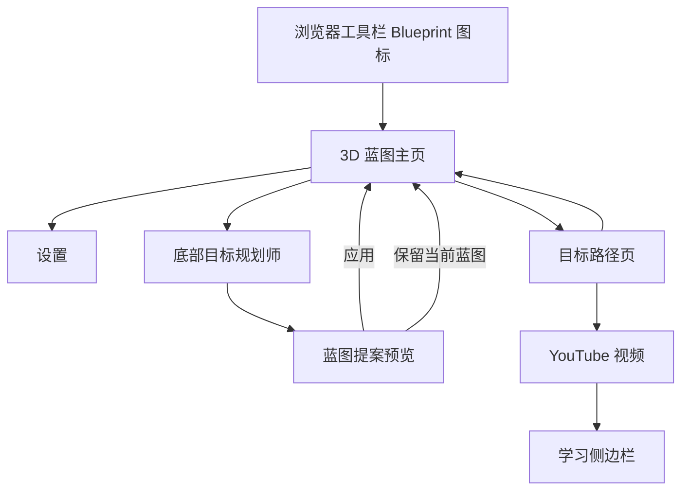

# Blueprint UI/UX 设计

## 1. 体验目标

Blueprint 的体验需要同时提供三种感受：

1. **方向感**：用户进入后能快速感知“我正在建设哪些目标”。
2. **可控感**：Agent 的每次蓝图修改都可预览、可拒绝，不会悄悄覆盖用户内容。
3. **行动感**：用户能从抽象目标逐层进入具体学习节点，并在 YouTube 中立即开始学习。

3D、主题和动效用于增加身份代入与重访兴趣，但可读性、清晰反馈和可恢复操作始终优先。

## 2. 信息架构



主页不提供全局进度、视图切换、右侧属性面板或多级导航。新增能力应优先归入“目标入口”“规划师”或“设置”，避免破坏这个简单心智模型。

## 3. 核心界面

### 3.1 3D 蓝图主页

页面由四个层级组成：

1. 品牌和页面标题。
2. 中央 3D 人物与环绕的顶层目标模块。
3. 空蓝图引导或目标入口。
4. 固定在页面底部的规划师 Dock。

人物是视觉中心，不承担复杂表单功能。用户可拖动 Canvas 旋转人物；无操作时存在轻量待机动画。目标按钮始终是标准 DOM 控件，不能把可操作文字绘制进 Canvas，从而保留键盘、辅助技术和响应式能力。

#### 空状态

首次进入不展示空旷且无解释的 3D 世界。中央卡片明确说明“还没有目标”，并提供“描述我的目标”按钮将焦点送到规划师输入框。

#### 有目标状态

每个顶层目标显示为人物周围的可点击模块。点击后进入独立目标路径页，而不是在主页展开大量细节。

### 3.2 目标规划师

规划师固定在主页底部，保持用户随时可见的修改入口。核心控件包括：

- 可收起的对话记录。
- 最多 20,000 字符的目标输入框。
- “发送目标”主操作。
- 生成期间出现的“停止生成”操作。
- `role=status` 的进度或错误反馈。

提交后输入、发送按钮和停止按钮必须反映运行状态，避免用户重复提交。取消应等待真实的 Agent abort 终态，不能只在界面上假装停止。

### 3.3 蓝图提案 Dialog

规划师返回提案后，使用模态 Dialog 展示：

- 提案摘要。
- 可滚动、可聚焦、自动换行的完整 Markdown。
- 应用失败或版本冲突信息。
- “保留当前蓝图”和“应用蓝图修改”两个明确动作。

“保留当前蓝图”使用次要样式，“应用蓝图修改”使用主样式。关闭、取消或应用失败后，用户都应能回到规划师继续修改。

### 3.4 目标路径页

目标路径页采用纵向里程碑时间线：

- 页头提供“返回蓝图”、目标名称和设置入口。
- 每个里程碑有明确序号与标题。
- 学习节点使用独立卡片。
- 已完成节点通过边框和文本状态共同表达，不能只依赖颜色。
- 有视频绑定时显示“在 YouTube 中开始学习”。
- 无视频绑定时显示“尚未绑定学习视频”。
- 目标不存在时展示可恢复空状态并返回主页。

### 3.5 YouTube 学习侧边栏

学习侧边栏是具体学习工作的承载面，不在 3D 主页重复建设。它继续负责：

- 原始字幕与时间戳跳转。
- 视频概览和章节。
- 中文与双语字幕。
- 选文讲解。
- 带时间戳笔记。

目标路径只负责把用户送到正确视频并打开 Side Panel。规划与学习之间共享上下文入口，但保持各自页面职责清晰。

### 3.6 设置页

设置页使用更安静的浅色工具界面，与沉浸式主页区分。设置内容包括：

- English / 简体中文界面语言。
- Supadata API Key。
- DeepSeek API Key。
- 本地 Agent 连接状态。
- Blueprint 主题。
- 自定义提示和复制辅助。
- 清理缓存、删除笔记和重置扩展数据。

连接状态由设置页向 Background 请求，不在设置页创建独立 Native Messaging 会话。

## 4. 关键交互流程

### 4.1 创建第一版蓝图

```text
空状态
→ 点击“描述我的目标”
→ 输入目标
→ 发送
→ 查看生成状态和对话增量
→ 预览完整提案
→ 应用或保留当前蓝图
→ 顶层目标出现
```

### 4.2 修改已有蓝图

用户可以在规划师中描述新增目标、调整顺序或修改路径。界面提交当前蓝图版本；如果其他页面已经更新蓝图，则显示版本冲突，并引导用户重新生成，而不是覆盖新内容。

### 4.3 开始学习

```text
顶层目标
→ 目标路径
→ 里程碑
→ 有视频绑定的学习节点
→ 当前标签进入 YouTube
→ 学习侧边栏打开
```

链接在领域模型和后台各校验一次。导航失败时仍保留普通链接回退，避免用户被困在路径页。

## 5. 状态设计

| 状态 | 首页/规划师 | 目标路径 | 设置/学习 |
| --- | --- | --- | --- |
| Loading | 加载本地蓝图；发送后显示生成状态 | 标题显示“加载中…” | Agent 连接显示“正在检查” |
| Empty | 解释为什么没有目标，并聚焦规划师 | 里程碑没有节点时给出完善提示 | 无字幕、无笔记使用明确空状态 |
| Success | 提案应用后重绘目标 | 展示里程碑和节点 | 已连接、已保存、已翻译等明确反馈 |
| Error | 显示 Host、协议、超时或版本冲突信息 | 目标不存在时可返回主页 | Key 缺失、字幕失败和 Agent 错误可见 |
| Disabled | 生成期间限制重复提交 | 不适用 | 保存或请求期间限制重复操作 |
| Partial | 文本增量可显示，但未完成前不产生持久化提案 | 未绑定视频仍可阅读节点 | 笔记润色失败时保留原文并标记未完成 |
| Long content | 对话受高度限制，提案预览可滚动和换行 | 标题与节点允许安全换行 | 字幕和提示区域独立滚动 |
| Host unavailable | 已有蓝图仍可浏览；规划功能给出安装提示 | 本地路径仍可查看 | 连接状态说明本地 Host 缺失 |

## 6. 主题系统

四种主题共享语义 Token：

- `--bg`
- `--surface`
- `--surface-strong`
- `--text`
- `--text-muted`
- `--accent`
- `--accent-ink`
- `--focus`
- `--danger`
- `--shadow`

| 主题 | 表达方向 | 不得改变的内容 |
| --- | --- | --- |
| 科幻 | 冷色、清晰、探索未知 | 层级、字段、操作名称 |
| 赛博朋克 | 高色度对比、能量感 | 信息优先级和状态语义 |
| 武侠 | 暖色、修炼和境界隐喻 | Markdown 结构和节点关系 |
| 现代都市 | 克制、中性、职业成长感 | 功能入口和用户流程 |

主题优先通过 OKLCH Token 改变背景、表面和强调色。不得为某一主题复制整套组件，也不得让主题颜色成为完成、错误或选择的唯一信号。

## 7. 响应式设计

- 支持的最小页面宽度为 320 CSS px。
- 桌面宽屏中，目标按钮按 3D 投影位置环绕人物。
- 在 640px 以下或高像素密度窄屏中，目标按钮退化为标准纵向 Grid，不要求用户在拥挤场景中点击浮动标签。
- 规划师 Dock 使用安全区 inset，避免被系统手势区域遮挡。
- 小屏中输入与动作按钮改为纵向排列。
- 目标时间线缩小序号和左侧留白，但保持阅读顺序不变。
- 设置页在 620px 以下收敛为单列布局。

## 8. 可访问性

当前设计基线以 WCAG 2.2 AA 为目标：

- 首页和目标页提供 Skip Link。
- Canvas 标记为装饰性，所有目标操作都有 DOM 按钮。
- 按钮最小高度为 44px。
- 键盘焦点使用高可见度 `focus-visible` 轮廓。
- 状态消息使用 `role=status` 和适当的 `aria-live`。
- 提案错误使用 `role=alert`。
- 对话折叠按钮同步 `aria-expanded`。
- 设置语言选择使用 `role=group` 和 `aria-pressed`。
- `prefers-reduced-motion: reduce` 时关闭非必要动画与平滑过渡。
- 文本、状态和错误不能只依赖颜色表达。

## 9. 文案原则

- 使用用户目标语言，不使用模型或协议术语作为主文案。
- 主操作以结果命名，如“应用蓝图修改”，避免模糊的“确定”。
- 错误说明“发生了什么”和“用户下一步能做什么”。
- 不声称 Agent 已经修改数据，直到扩展确认持久化成功。
- 不把“规划师建议”写成客观保证。
- 规划师输入示例应具体、可想象，并包含时间或成果约束。

## 10. 动效原则

- 待机动画用于维持生命感，不应与输入、阅读竞争注意力。
- 拖动人物时反馈应直接，不使用过长缓动。
- 按钮 hover、active 和状态转换以约 150ms 的轻量反馈为主。
- 生成中的动态反馈必须同时有文本状态。
- 用户启用减少动态效果后，布局与功能保持完整。

## 11. 设计验收清单

每次 UI 变更至少检查：

- 主页空状态和有目标状态。
- 人物拖动、目标点击、设置入口和规划师折叠。
- 生成、停止、错误、提案预览、取消和应用。
- 版本冲突后的恢复路径。
- 目标不存在、无节点、无视频绑定和已完成节点。
- YouTube 节点导航和 Side Panel 打开。
- 320px 起的窄视口、桌面视口和长文本。
- Tab 顺序、Skip Link、焦点可见性和 Dialog 焦点。
- `prefers-reduced-motion`。
- 四种主题下的文字对比与状态辨识。
- 浏览器控制台错误和失败网络请求。
