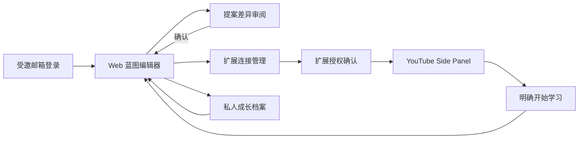

# Blueprint 当前 UI/UX（M1 与后续已实现切片）

## 1. 本阶段体验目标

M1 界面负责证明账号、蓝图与扩展连续性，不提前冒充正式 3D 产品。用户必须能清楚完成四件事：登录、编辑并确认蓝图、授权扩展、从 YouTube 明确开始一次学习会话。

正式 3D 身份状态面板、Agent 对话澄清和完整学习工作台分别见[目标 UI/UX 规划](target-ui-ux-plan.md)与后续阶段路线。

## 2. 信息架构

## 3. Web

### 登录

- 单字段受邀邮箱入口，说明当前为邀请自测。
- 请求统一提示“如果已受邀，登录链接已经发送”，不暴露白名单。
- 邮件发送后锁定地址并提供明确的“更换邮箱”恢复入口；链接需要在发起请求的同一浏览器中打开，以完成 PKCE 会话交换。
- 返回邮箱步骤会清空旧成功/错误提示；发送期间禁用重复提交，成功后按钮明确显示“邮件已发送”。

### 蓝图首页

首页目前是二维科幻 HUD，而非 M3 的正式 3D 面板。它显示：

- 当前账号和蓝图版本；
- 一个最小人物状态占位区，明确标注 3D 身份模块属于 M3；
- Goal、Stage、Path Node 和可选 YouTube 资源的结构化编辑器；
- 最近学习会话和扩展连接入口。

编辑器服务于纵向验证，不追求成为通用任务管理器。Path Node 类型使用用户可读标签；资源只接受规范 YouTube watch URL。

### 提案审阅

编辑不会立即修改正式蓝图。用户先看到增、改、移动和归档差异，再选择应用或拒绝。若基础版本已变化，页面明确显示冲突并要求基于新版本重试。

### 连接管理

用户可以查看扩展 OAuth grant 并撤销。授权页明确列出扩展获得的职责；已有 grant 可安全复用，拒绝不会创建扩展会话。

### 成长档案（已托管发布，真实双端旅程待验收）

独立 `/progress` 页面从正式路径节点记录私人文字和可选作品链接，显示最近 50 条及提交时的路径上下文，不自动判断完成。双主题共用相同表单和恢复语义：编辑中新草稿明确未保存，断网回执不明只能确认原提交结果，路径更新需明确重新关联。账号／蓝图隔离缓存、多标签只读保护和历史错误状态均避免静默丢失；外链经过安全锚点检查。完整边界与证据见[私人成果记录](progress-evidence.md)。

## 4. YouTube 扩展

Side Panel 始终说明自己是 Blueprint 的 YouTube 子场景，而不是独立产品。

未连接时只显示授权入口。连接后显示：

- 当前账号；
- 缓存数据或待同步状态；
- 当前视频对应的 Goal / Stage / Path Node；
- 明确的“开始学习”按钮；
- 所有已绑定 YouTube 节点和返回 Web 的入口。

打开视频本身不产生学习记录。“开始学习”成功后才回写；离线时明确提示已进入队列，并允许重试。当前视频没有匹配时不猜测归属，而是让用户选择已绑定节点或返回 Web 修改。

新增“记录学习收获”入口复用 Web 成长档案的表单与近期历史，收起不丢失状态；它独立于“开始学习”及旧会话队列。用户明确选择正式节点，切视频不自动改写关联。双主题紧凑单栏已通过真实 MV3／外部 HTTP 夹具检查；托管数据库及 API 已发布，但本批未重载用户安装版，真实双端成果旅程尚待验收。

## 5. 状态与恢复

| 状态 | Web | 扩展 |
| --- | --- | --- |
| Loading | 登录、加载蓝图和提交按钮显示进行中 | 检查授权和加载上下文 |
| Empty | 空蓝图提供结构化新增入口 | 无绑定资源时说明下一步 |
| Success | 提案应用后刷新版本与修订结果 | 学习会话写入后确认 |
| Conflict | 保留草案，提示重新基于最新版本操作 | 不适用 |
| Offline | 页面不伪装数据已保存 | 显示缓存标记和账号隔离 outbox |
| Unauthorized | 回到登录页 | 回到连接入口 |
| Revoked | 连接管理显示授权已经撤销 | 下次请求要求重新授权 |

## 6. 视觉系统

Web 与扩展共享 `packages/ui/src/tokens.css` 的语义 Token 和基础组件，已接入赛博朋克与东方主题及云端账号偏好；扩展跟随 Web。成长档案采用网格切角／纸面圆印区分表现，不重置编辑状态。这些是双主题基础与页面切片，不代表正式双主题 3D、美术或整套商用品质门槛通过。双主题整体设计、公开示例和成果反馈见[目标 UI/UX 规划](target-ui-ux-plan.md)。

必须保持：

- 普通 DOM 表单和按钮；
- 清晰的 focus-visible；
- 状态不只依赖颜色；
- 320px 起可用、无横向溢出；
- `prefers-reduced-motion` 关闭非必要动效；
- 主操作命名结果，而不是使用模糊的“确定”。

M3 可以替换人物和目标表达层，但不能改变这些可操作语义。

## 7. 已验证范围

- 登录页已经在真实浏览器中验证邮箱→邮件已发送→更换邮箱的恢复流程。
- Playwright 同时覆盖桌面 Chrome 和 Pixel 5 视口，并检查无横向溢出。
- 已记录真实托管邮件链接回调、重新登录及扩展重新连接；第二账号、完整 consent／撤销及提供方旅程仍有待验项，详见[实时路线](execution-roadmap.md)，不将部分通过写成全部 M1 验收完成。
- 成长档案的真实本地 Auth／保存／重载／离线恢复／多标签接手，以及双主题桌面与 320px 已验证；不等于该页面已经部署到线上。
